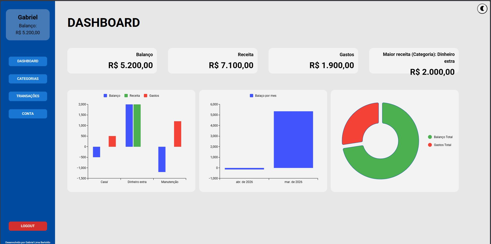
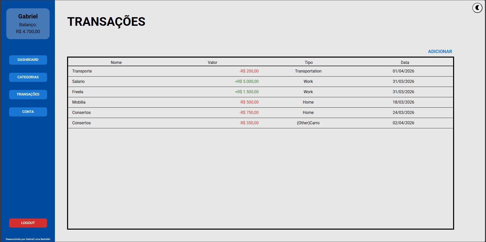
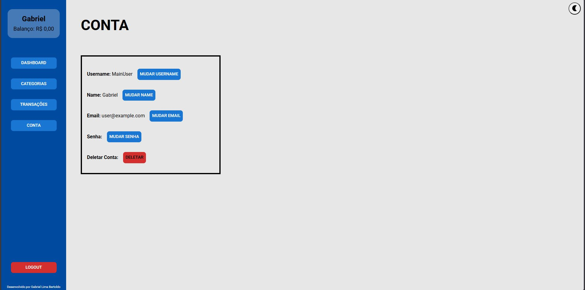
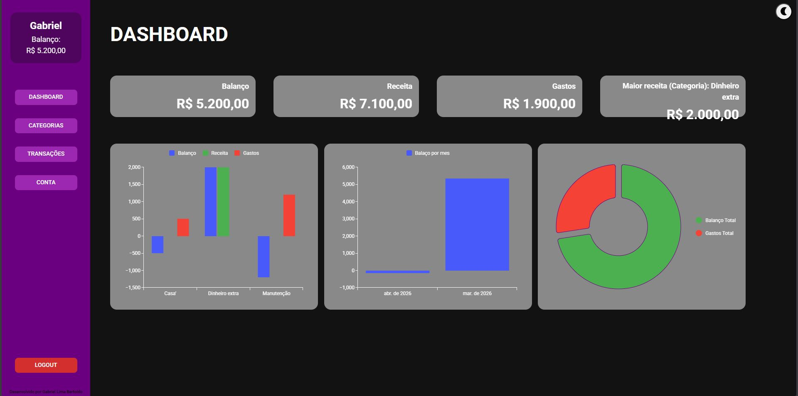

# 🚀 Finance App Fullstack

Sistema de gerenciamente de gastos e ganhos

## 🎯 Objetivo

Projeto desenvolvido com foco em arquitetura fullstack moderna, autenticação segura e deploy em ambiente cloud.

## 🛠 Tecnologias

### Backend
- ASP.NET Core 8
- Entity Framework Core
- SQL Server
- Postgres SQL (em deploy no Neon)
- JWT Authentication

### Frontend
- React
- TypeScript
- Axios
- Material UI (MUI)
- Vercel Analytics/Speed Insight

  ### Cloud / Deploy
- Render (Backend)
- Vercel (Frontend)
- Neon (Database)

## 🔐 Funcionalidades

- Registro de usuário
- Modificação de usuário
- Deletar usuário
- Login com JWT
- Logout
- Rotas protegidas
- CRUD completo de tarefas
- Dashboard com graficos
- Criação de transações 
- Criação de categorias

---

## 🌍 Live Demo
- Web: https://finance-app-react-csharp.vercel.app

---

## ⚙️ Como rodar localmente

### Backend

```bash
dotnet restore
dotnet ef database update
dotnet run
```

### Frontend

```bash
npm install
npm run dev
```

## 🔐 Variáveis de Ambiente

```markdown
O projeto utiliza:

- `Jwt:Key`
- `ConnectionStrings:DefaultConnection`

As credenciais não estão versionadas e devem ser configuradas via User Secrets ou variáveis de ambiente.
```

### Dashboard


### Transações


### Categories


### Opções Conta


### Dark Mode



